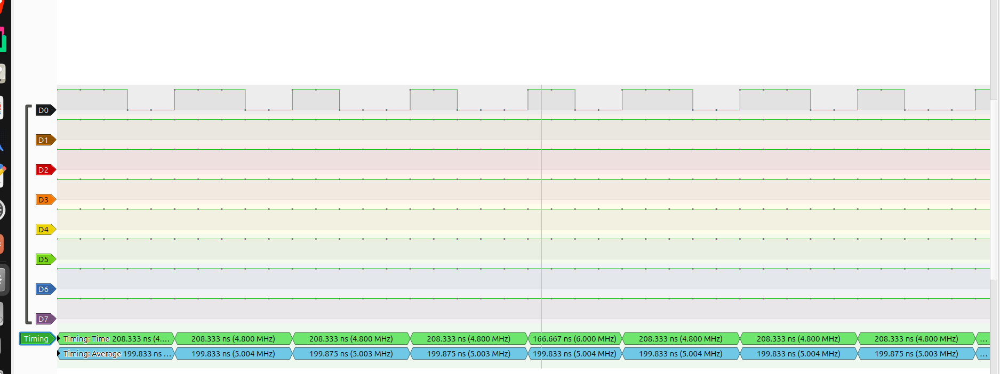
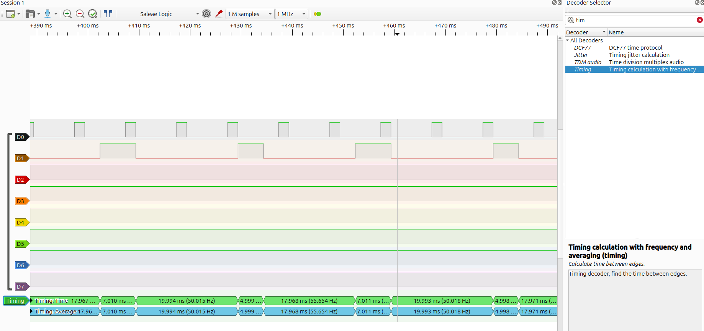
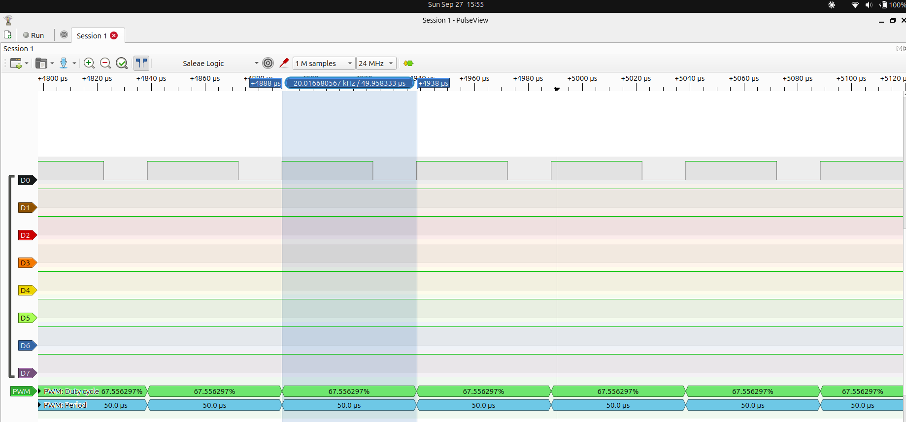

# freertos-hil-motor-control

A distributed real-time control system built on FreeRTOS, tested on a
**Hardware-in-the-Loop (HIL) bench**: an STM32 controller drives a DC motor
that is simulated in real time by an ESP32, while a second ESP32 supervises
the whole system and streams it to a PC dashboard.

The goal is not only a working system. The timing behaviour of every task and
every link is **computed analytically first, then verified by measurement**
on the hardware.

**Status:** Phase 1 complete (STM32 real-time core, first timing measurements).
Phase 2 in progress: setpoint acquisition and motor PWM done, encoder input next.
Phase 0 is waiting for a board modification to switch the clock from HSI to HSE.

## Architecture

```
  ESP32 #1                     STM32L476RG                    ESP32 #2
  Plant simulator   <-- PWM ---  Real-time controller  -- UART -->  Supervisor
  (DC motor model)  -- A/B  -->  (FreeRTOS)                         & gateway
                     quadrature                                        |
                                                                     Wi-Fi
                                                                       |
                                                                  PC dashboard
```

| Node | Role |
|---|---|
| **STM32L476RG** | Real-time controller: speed control loop, state machine, fault detection, timing instrumentation. Its firmware is identical to what a real motor would need. |
| **ESP32 #1** | Plant simulator: fixed-step DC motor model, measures the controller's PWM and generates real quadrature encoder signals. Supports fault injection. |
| **ESP32 #2** | Supervisor: receives system state and events, detects node loss, timestamps and forwards everything to the PC. |
| **PC** | Dashboard: live curves, faults, task timeline. |

### Design principles

- Every task exists for one reason; priorities are derived from deadlines, not guessed.
- Interrupt handlers do the minimum and defer work to tasks.
- No dynamic allocation: every kernel object is created statically, and heap usage is monitored at run time.
- No stateful newlib calls (`printf`, `malloc`, `strtok`) from tasks, so `USE_NEWLIB_REENTRANT` is not needed.
- Faults are fail-stop and visible: `Error_Handler`, stack-overflow and malloc-failed hooks freeze the system and light LD2.
- The supervisor observes but never drives the real-time loop: if Wi-Fi or the
  PC fails, the control loop keeps running safely.
- Emergency stop is hardware, local to the controller, never through a link.
- What is not measured is not claimed.

## Results

All measurements: GCC `-O2` unless stated, SYSCLK 80 MHz from **HSI** (until the
board modification), FreeRTOS 10.3.1, tick 1 kHz.
Instruments: DWT cycle counter (12.5 ns), logic analyser (FX2, up to 24 MS/s), CubeIDE Live Expressions.

### Clock

| Metric | Predicted | Measured |
|---|---|---|
| MCO (SYSCLK/16) on PA8, HSE source | 5 MHz | not available: HSE not connected on unmodified board |
| MCO (SYSCLK/16) on PA8, HSI source | 5 MHz | 5.0035 MHz → SYSCLK **80.06 MHz (+0.07 %)**, resolution ±0.02 % |



### Scheduling (task A: C=2 ms, T=10 ms; task B: C=5 ms, T=25 ms; deadline-monotonic priorities)

Measured with `-O0`, logic analyser at 1 MS/s.

| Metric | Predicted | Measured |
|---|---|---|
| Task B response, not preempted | 5 ms | 4.998–4.999 ms (HSI running 0.07 % fast) |
| Task B worst-case response, preempted once by A | 7 ms (naive model) | **7.010–7.011 ms** |
| Preemption overhead (tick + 2 context switches + delay call) | not modelled | ~10 µs (first estimate) |
| Task B start jitter | ±2 ms (= C_A) | ±2.02 ms |



### Kernel overhead

Notify-to-wake latency: a low-priority task timestamps with DWT, calls
`xTaskNotifyGive`, and a higher-priority task blocked in `ulTaskNotifyTake`
reads DWT when it wakes.

| Build | Samples | Min | Avg | Max |
|---|---|---|---|---|
| `-O0` | 13 841 | 987 cycles (12.3 µs) | 987 | 987 |
| `-O2` | 11 488 | **503 cycles (6.3 µs)** | 519 | 556 cycles (7.0 µs) |

### Controller I/O

Setpoint chain: TIM3 (10 kHz) triggers ADC1 in hardware, circular DMA fills 2 × 10
samples, and each half-transfer interrupt notifies the acquisition task, which averages
the block (1 kHz setpoint). The task itself starts the hardware, so no interrupt can
ever notify a task that does not exist yet. Motor PWM: TIM1 CH2, 20 kHz, 4000 steps,
compare preload enabled; currently driven open-loop from the setpoint.

| Metric | Predicted | Measured |
|---|---|---|
| Setpoint acquisition rate | 1000 blocks/s, 0 late, 0 overrun | 1000 blocks/s, 0 late, 0 overrun |
| ISR-to-task latency (DMA ISR → `xTaskNotifyFromISR` → task), steady state | — | min 776 / avg 815 / max **847 cycles** (9.7 / 10.2 / 10.6 µs) |
| Same, first wake-ups after reset (cold instruction cache) | — | up to 1432 cycles (17.9 µs) |
| PWM frequency (TIM1 CH2, PA9) | 20 kHz (20.014 kHz with HSI +0.07 %) | 20.017 kHz on one period, ±0.08 % (analyser: 1199 samples/period) |
| PWM duty follows setpoint (open loop) | proportional | 31.7 / 67.6 / 74.2 % at three positions, ±1 sample (0.08 %) |
| PWM period while duty changes (preload enabled) | constant | constant, no glitch observed |



### Memory

| Metric | Measured |
|---|---|
| Footprint, FreeRTOS enabled, no application tasks (`-O0`) | FLASH 18.91 KB / 1024 KB, RAM 8.98 KB / 96 KB, RAM2 0 / 32 KB |
| FreeRTOS heap usage | 0 allocations: heap_4 never initialised, malloc-failed hook never hit |
| Stack high-water mark, tasks A / B / health (256 words each) | 222 / 223 / 222 words free (~34 used, no FPU context yet) |

### Key findings so far

1. **The naive response-time model is optimistic.** `R = C_B + ⌈R/T_A⌉·C_A` predicts 7 ms; the
   measurement is 7.011 ms. The model ignores kernel preemption overhead, which must be measured
   and added to the analysis.
2. **A measured maximum is not a bound.** At `-O0`, every one of 13 841 latency samples was
   identical because the tick, the HAL time base and all task releases are phase-locked: no
   interrupt ever fell inside the measurement window. TIM3 is derived from the same clock, so the
   DMA interrupt is phase-locked too. Only analysis gives a worst case.
3. **The binary matters.** The same kernel on the same hardware wakes a task twice as fast
   at `-O2` as at `-O0`, and even an unrelated code change moved the ISR-to-task minimum from
   795 to 776 cycles by shifting code in flash. Numbers are valid for one binary only.
4. **Start-up is not steady state.** The first wake-ups after reset cost up to 1432 cycles
   (cold instruction cache) against 847 in steady state. Statistics skip a 10-sample warm-up.
5. **A debugger stops the core, not the peripherals.** Halting the core let the DMA overwrite
   both buffer halves (4 late blocks). TIM3 and TIM1 are now frozen on debug halt; for TIM1 this
   also disables the PWM outputs, so a halted controller never keeps driving the motor.
6. **Clock error propagates.** The +0.07 % HSI error measured on MCO reappears in task timing:
   a 5 ms busy-wait counted in cycles lasts 4.9965 ms.
7. **Know the instrument's resolution.** At 24 MS/s the analyser resolves the PWM duty to
   1/1199 (0.08 %), coarser than the PWM itself (1/4000). A 0.08 % step between periods is the
   instrument, not the signal.

**Open questions**

- Task-to-task latency varies by 53 cycles at `-O2` (503–556): tick interrupt inside the window
  or instruction-cache state, to be decided with a latency histogram.
- The ADC overrun counter has never been seen to increment: the error path must be exercised
  by forcing an overrun (phase 5).

## Hardware

- NUCLEO-L476RG (MB1136 C-05). **Modification planned**: SB16 and SB50 ON, SB55 OFF, so that
  HSE receives the 8 MHz MCO from the ST-LINK. On this board the MCO is not connected to OSC_IN
  by default, whatever the revision (UM1724 §6.7.1). Until then the PLL runs from HSI.
- 2 × ESP32
- Potentiometer (speed setpoint): ends on 3V3 and GND, wiper on A0. Never on 5 V.
- Push buttons, LEDs, I2C RTC module (fault timestamps)
- Logic analyser (8 ch, 24 MS/s)

### Pin map (STM32)

| Pin | Arduino | Function |
|---|---|---|
| PA0 | A0 | Setpoint potentiometer (ADC1 IN5) |
| PA9 | D8 | Motor PWM (TIM1 CH2, 20 kHz) |
| PA6 | D12 | Reserved: TIM1 break input (hardware emergency stop, phase 5) |
| PA8 | D7 | MCO (SYSCLK/16) |
| PA10 | D2 | `TP_TASK_A` timing pin |
| PB5 | D4 | `TP_TASK_B` timing pin |
| PB4 | D5 | `TP_TASK_C` timing pin (acquisition task) |
| PB10 | D6 | `TP_ISR` timing pin (DMA interrupt) |
| PA5 | D13 | `LED_FAULT` (LD2) |
| PA13 / PA14 / PB3 | — | SWD + SWO (reserved) |

## Toolchain

- STM32: STM32CubeIDE, CubeMX, HAL, FreeRTOS (native API; CMSIS-RTOS v2 layer only where CubeMX requires it)
- ESP32: ESP-IDF (FreeRTOS SMP)
- PC: Python, PulseView / sigrok

## Roadmap

### Phase 0 — Foundations
- [x] Repository structure
- [x] CubeMX project for NUCLEO-L476RG
- [x] Clock tree designed: HSE bypass → PLL → 80 MHz, MCO on PA8
- [x] HSE start-up failure diagnosed with debugger and UM1724
- [x] Temporary clock: HSI → PLL → 80 MHz, verified on MCO
- [ ] Board modification (SB16, SB50 ON, SB55 OFF)
- [ ] Switch back to HSE and repeat the MCO measurement

### Phase 1 — STM32 real-time core
- [x] FreeRTOS, native API, static allocation only
- [x] HAL time base moved to TIM6, SysTick left to the kernel
- [x] Two periodic tasks with dedicated timing pins
- [x] DWT cycle counter as the measurement base
- [x] First response-time analysis, predicted then measured
- [x] Health task: heap usage and stack high-water marks
- [x] Fail-stop fault handling with visible LED
- [x] Notify-to-wake latency measured at `-O0` and `-O2`
- [ ] Latency histogram to explain the `-O2` variation

### Phase 2 — Controller I/O
- [x] Setpoint acquisition: timer-triggered ADC, circular DMA, double buffer
- [x] ISR → task hand-off with task notifications, latency measured
- [x] PWM output to the motor (TIM1, 20 kHz, preload), open loop from setpoint
- [x] TIM1 / TIM3 frozen on debug halt
- [ ] Quadrature encoder input (timer in encoder mode)
- [ ] Health task extended to the new tasks' stacks
- [ ] Phase-1 experiment tasks (A, B, ctxRx, ctxTx) behind a build switch

### Phase 3 — Plant simulator (ESP32 #1)
- [ ] DC motor model, fixed-step integration, parameters from a real motor datasheet
- [ ] PWM duty measurement
- [ ] Quadrature signal generation
- [ ] Simulator characterised: step jitter, signal timing accuracy

### Phase 4 — Closed-loop control
- [ ] Speed control loop (PI) at a fixed rate
- [ ] Shared state protected by mutex, priority inversion reproduced and resolved
- [ ] I2C RTC as slow peripheral task
- [ ] Step response validated against the model

### Phase 5 — Fault management
- [ ] State machine: normal / alert / fault
- [ ] Fault injection from the simulator: stall, encoder loss, noise
- [ ] Detection deadlines specified and verified
- [ ] Hardware emergency stop, clock-loss fault (CSS)

### Phase 6 — Supervisor and links (ESP32 #2)
- [ ] Framed UART protocol: sequence numbers, CRC, heartbeat
- [ ] Node-loss detection
- [ ] Wi-Fi gateway to the PC

### Phase 7 — Dashboard
- [ ] Live setpoint and speed curves
- [ ] Fault log with timestamps
- [ ] Task timeline built from traces

### Phase 8 — Timing analysis and measurement campaign
- [ ] Response-time analysis including measured kernel overhead
- [ ] End-to-end latency, from fault to dashboard
- [ ] CPU load per task, trace intrusiveness

### Phase 9 — Hardening
- [ ] Watchdog, degraded modes
- [ ] Long-run tests (24 h)
- [ ] Final documentation

## Repository layout

```
firmware/    STM32 controller (STM32CubeIDE project)
tools/       Scripts and helpers
captures/    Logic analyser captures
```

Planned: `simulator/` (ESP32 #1), `supervisor/` (ESP32 #2), `dashboard/` (PC).
